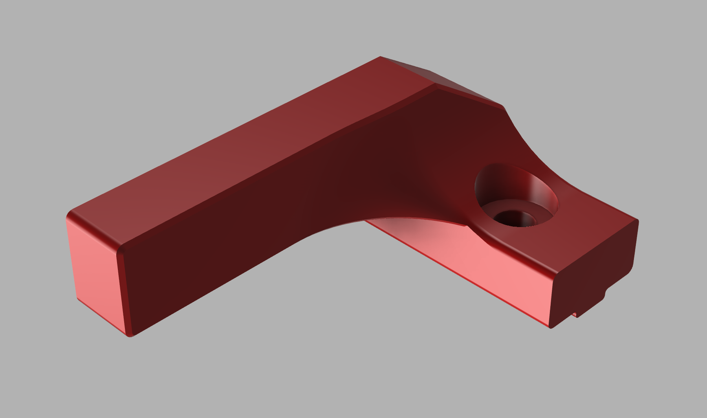
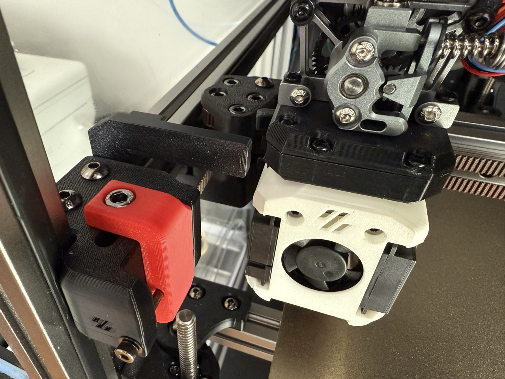

# Trident and v2.4 Trigger arm for Dragon Burner Cutter

This is a trigger arm for use on my Trident 300 (LDO kit) using a Dragon Burner with the [MGN9H X Carriage from chirpy2605 Alternative Voron Mounts](https://github.com/chirpy2605/voron/blob/main/general/Alternative_Voron_Mounts/Modified_Mounts/V1_V2/STLs/MGN9H/MGN9H_X_Carriage_Lite_lugs.stl)

The available trigger arm for the Dragon Burner Cutter sat much too high on my printer so this is a much shorter one that will sit just above the front idler hight.

The trigger can be used on either side (mirror it as necessary) in the front. It might also work in the back though that is untested. I find that I need 20mm of travel to fully depress the Dragon Burner Cutter so factor that in with the placement. With standard front idlers on a Trident the trigger will be about 21mm back.

### BOM

- 1 M5 roll in nut (recommended over a drop in T-Nut)
- 1 M5 x 10 BHCS (SHCS may work but may also benefit from a washer)

### Print Settings

Use standard Voron print settings

### STLs

[Dragon Burner Cutter Trigger](stls/dragon_burner_cutter_trigger_trident.stl)

### Images

